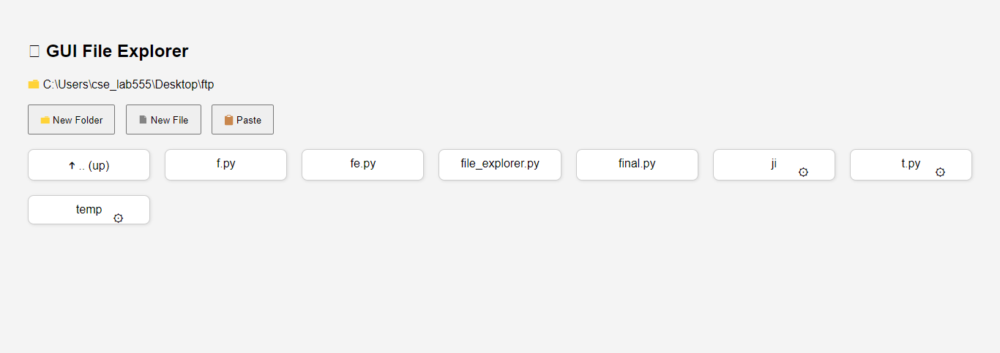
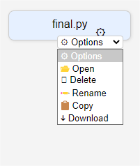

# 🧭 Http-File-Explorer

A lightweight web-based file manager built using Python Flask.
Browse, manage, and download files directly from your browser with a simple and responsive UI.

---

## 🚀 Features

-   📁 Navigate directories
-   🗑️ Delete files or folders
-   ✏️ Rename items
-   📋 Copy & Paste support
-   📄 Create new files and folders
-   ⬇️ Download files
-   ⚙️ Dropdown actions per item

---

## 📸 Screenshots

_(examples)_


_Example of the file explorer interface._


_Dropdown menu showing file actions._

---

## 📦 Requirements

-   Python 3.x
-   Flask

---

## 💻 Usage

1.  **Install Dependencies:**

    ```bash
    pip install flask
    ```

2.  **Run the Application:**

    ```bash
    python app.py
    ```

3.  **Access the Explorer:**

    Then open your browser and go to:
    👉 [http://localhost:8000](http://localhost:8000)

---

## 🐳 Docker Support (Optional)

For easier setup and deployment, you can use Docker:

1.  **Build the Docker Image:**

    ```bash
    docker build -t http-file-explorer .
    ```

2.  **Run the Docker Container:**

    ```bash
    docker run -p 8000:8000 -v $(pwd):/app http-file-explorer
    ```

    * `-p 8000:8000`:  Maps port 8000 of the container to port 8000 on your host.
    * `-v $(pwd):/app`:  Mounts your current directory (where `app.py` is located) to the `/app` directory inside the container. This allows the container to access and modify files in your current directory.

---

## 🔗 Download & Clone Options

-   🌐 Git (HTTPS):
    `https://github.com/Kaviputhalvan/Http-File-Explorer.git`

-   📦 Download ZIP:
    [https://github.com/Kaviputhalvan/Http-File-Explorer/archive/refs/heads/main.zip](https://github.com/Kaviputhalvan/Http-File-Explorer/archive/refs/heads/main.zip)

-   🔐 Git (SSH):
    `git@github.com:Kaviputhalvan/Http-File-Explorer.git`

-   📥 GitHub CLI:

    ```bash
    gh repo clone Kaviputhalvan/Http-File-Explorer
    ```

---

## 🛡️ Note

⚠️ This app runs in the **current working directory** and has full access to files and folders.
Use it responsibly and avoid running it in sensitive system locations.

---

## 🧑‍💻 Contributing

Contributions are welcome! If you have any ideas, bug reports, or feature requests, please open an issue or submit a pull request.

---

## 👤 Author

**K.Kaviputhalvan**
📧 Email: [k.kavi.cpm100@gmail.com](mailto:k.kavi.cpm100@gmail.com)

---

## 📜 License

This project is open-source. Use it, modify it, share it — responsibly.

---

## 🏷️ Badges

_(You can add these badges using services like Shields.io. Replace the URLs with the correct ones.)_

[](https://flask.palletsprojects.com/)
[](https://www.python.org/)
